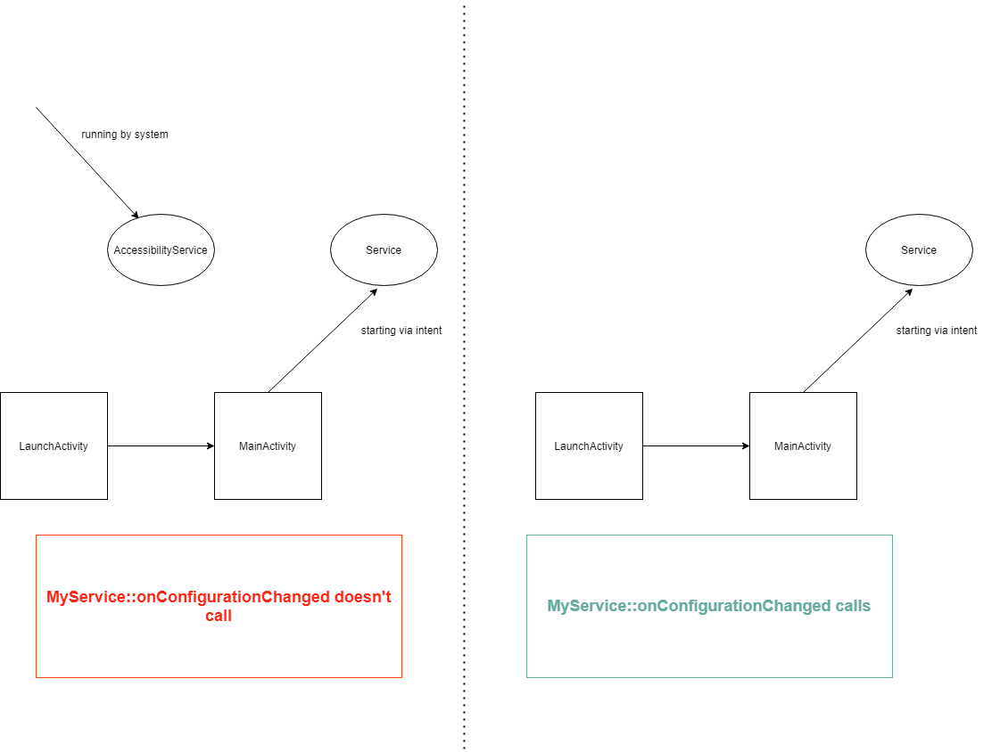
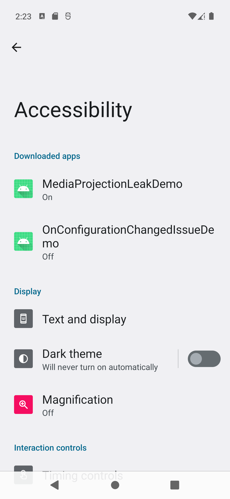

# onConfigurationChanged doesn't call if there is 2 conditions on Android 12-13
## Description
onConfigurationChanged in Service doesn't call if there 2 conditions on Android 12-13:
1. Service started NOT from LaunchActivity (Activity with Intent-filter with android.intent.category.LAUNCHER category)
2. There is running AccessibilityService


Bug in issuetracker: https://issuetracker.google.com/issues/336161242

## How to reproduce
1. Create empty project
2. Create empty AccessibilityService:
```class MyAccessibilityService : AccessibilityService() {
    override fun onAccessibilityEvent(event: AccessibilityEvent?){
        Log.i("MyAccessibilityService", "onAccessibilityEvent")
    }

    override fun onInterrupt() {
        Log.i("MyAccessibilityService", "onInterrupt")
    }

    override fun onCreate() {
        super.onCreate()
        Log.i("MyAccessibilityService", "onCreate")
    }

    override fun onServiceConnected() {
        super.onServiceConnected()
        Log.i("MyAccessibilityService", "onServiceConnected")
    }

    override fun onDestroy() {
        super.onDestroy()
        Log.i("MyAccessibilityService", "onDestroy")
    }
}
```


You can use config like this [app/src/main/res/xml/accessibility_service_config.xml](app/src/main/res/xml/accessibility_service_config.xml)

3. Create Service:

```
class MyService : Service() {

    override fun onConfigurationChanged(newConfig: Configuration) {
        super.onConfigurationChanged(newConfig)
        Log.i("MyService", "onConfigurationChanged newConfig = $newConfig")
    }

    override fun onBind(intent: Intent): IBinder? = null

    override fun onCreate() {
        super.onCreate()
        Log.i("MyService", "Created.")
    }
}
```

4. Create LaunchActivity:
```
class LaunchActivity : AppCompatActivity() {
    override fun onCreate(savedInstanceState: Bundle?) {
        super.onCreate(savedInstanceState)
        setContentView(R.layout.activity_launch)
        Handler(Looper.myLooper()!!).postDelayed({
            startActivity(Intent(this, MainActivity::class.java))
            finish()
        }, 3000)
    }
}
```

Decalre this activity in manifest:
```
        <activity
            android:name=".LaunchActivity"
            android:exported="true">
            <intent-filter>
                <action android:name="android.intent.action.MAIN"/>

                <category android:name="android.intent.category.LAUNCHER"/>
            </intent-filter>
        </activity>
```

5. Finally create MainActivity:

```
class MainActivity : AppCompatActivity() {
    override fun onCreate(savedInstanceState: Bundle?) {
        super.onCreate(savedInstanceState)
        setContentView(R.layout.activity_main)
    }

    override fun onResume() {
        super.onResume()

        findViewById<TextView>(R.id.startAccessibilityButton).setOnClickListener {
            val intent = Intent(Settings.ACTION_ACCESSIBILITY_SETTINGS)
            intent.flags = Intent.FLAG_ACTIVITY_NEW_TASK
            startActivity(intent)
        }
        findViewById<TextView>(R.id.startServiceButton).setOnClickListener {
            startService(Intent(this, MyService::class.java))
        }
    }
}
```

### Steps to reproduce

1. Install application
2. Start MyAccessibilityService from settings:

3. Run MyService from the app
4. press back and close activity
5. Rotate screen

Expected: onConfigurationChanged called
Actual: onConfigurationChanged doesn't call

## Additional info:
If you skip ANY of this condition, it works fine.
### Don't use LaunchActivity:
```
        <activity
            android:name=".MainActivity"
            android:exported="true">
            <intent-filter>
                <action android:name="android.intent.action.MAIN"/>
                <category android:name="android.intent.category.LAUNCHER"/>
            </intent-filter>
        </activity>

``` 

OR 

### Don't start AccessibilityService